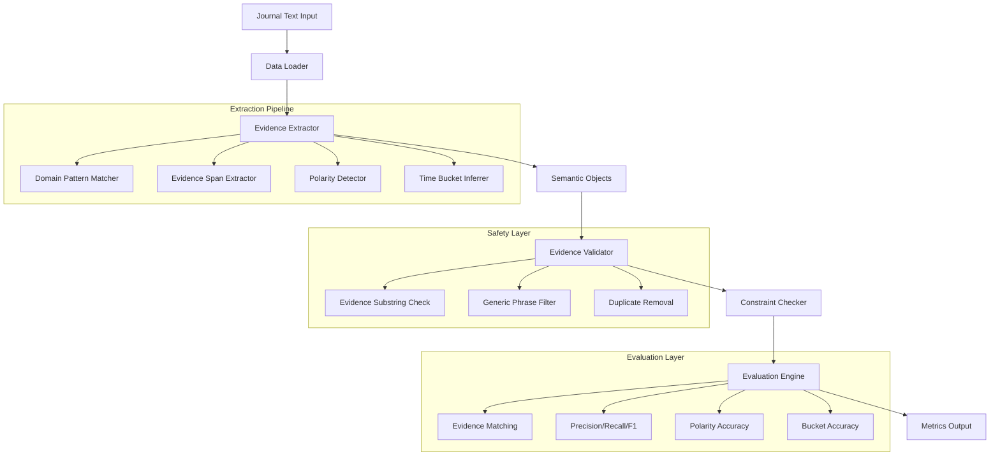
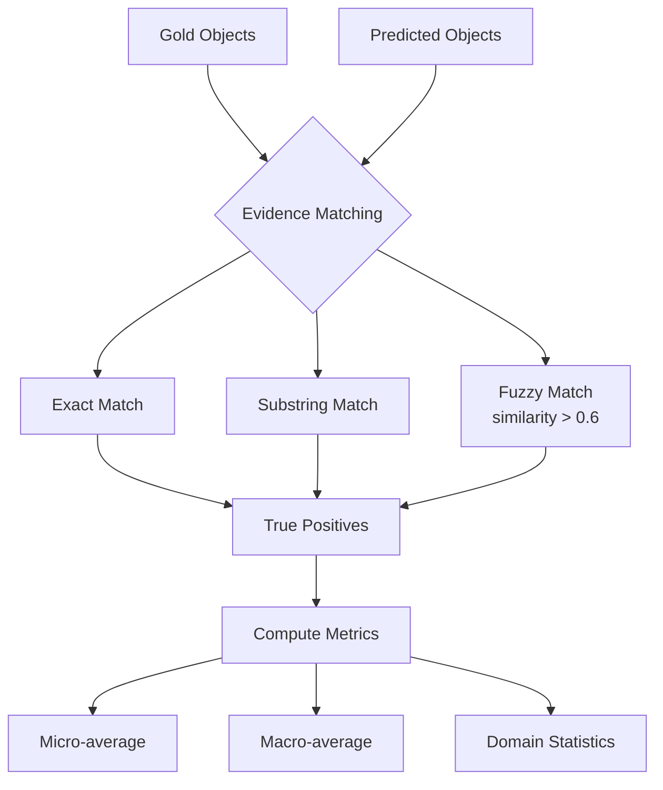
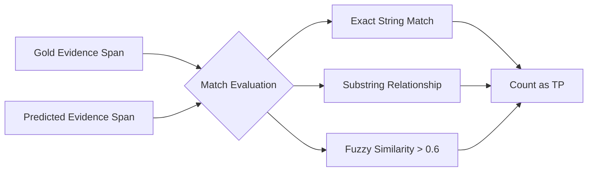
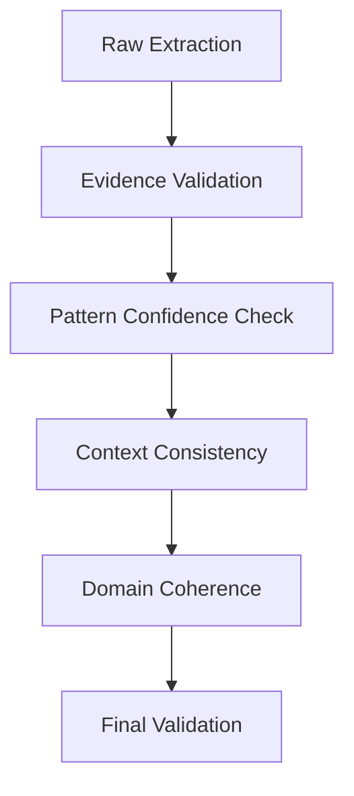

# 🩺 Ashwam Evidence-Grounded Extraction & Evaluation Pipeline

## 📋 Project Overview

### What Did We Build?
We built an **evidence-grounded semantic extraction pipeline** for Ashwam journal entries that extracts symptoms, food, emotions, and mind states from messy, multilingual journal text without relying on canonical labels. The system maintains strict evidence grounding—every extracted item includes exact text spans from the original journal—and provides objective evaluation metrics despite the absence of fixed vocabularies.

### Solution End-to-End
```
Journal Input → Data Loading → Rule-Based Extraction → Validation → Evaluation → Metrics Output
```

The pipeline processes multilingual journal entries (English, Hindi, Hinglish), extracts semantic objects with evidence spans, validates extractions against safety constraints, evaluates against gold references without canonical labels, and produces comprehensive metrics.

## 🔑 Key Assumptions

1. **Evidence Span Sufficiency**: Exact evidence span in the journal text is sufficient for evaluation without requiring canonical labels
2. **Domain Distinction**: Symptoms, food, emotions, and mind states can be distinguished primarily through syntactic patterns rather than semantic knowledge
3. **Time Bucket Inference**: Time references are either explicit in text or can be reasonably inferred from context
4. **Multilingual Patterns**: Similar syntactic patterns apply across languages (English, Hindi, Hinglish) for domain detection
5. **Negation/Uncertainty Detection**: Negation and uncertainty are expressed through specific linguistic patterns detectable via regex

## 🏗️ System / Pipeline Breakdown

### Architecture Overview



### Component Responsibilities

#### 1. **Data Loader**
- Handles multiple JSONL formats (Python dict syntax and standard JSON)
- Robust parsing with multiple fallback strategies
- Validates data integrity

#### 2. **Evidence Extractor**
```
┌─────────────────────────────────────────────┐
│            Extraction Process               │
├─────────────────────────────────────────────┤
│ 1. Sentence Segmentation                    │
│ 2. Domain Pattern Matching (no fixed lists) │
│ 3. Evidence Span Capture (exact substring)  │
│ 4. Polarity Detection (present/absent/unc)  │
│ 5. Time Bucket Inference                    │
│ 6. Intensity/Arousal Assessment             │
└─────────────────────────────────────────────┘
```

#### 3. **Safety Validator**
- Ensures evidence spans are valid substrings of journal text
- Filters generic phrases (e.g., "felt," "was")
- Removes duplicate extractions
- Validates constraint compliance

#### 4. **Evaluation Engine**



## ⚙️ Determinism & Safety Controls

### Determinism Guarantees
- **No Randomness**: All operations are deterministic (no LLM sampling, no random components)
- **Sorted Processing**: Journals processed in alphabetical ID order
- **Consistent Matching**: Evidence matching uses fixed similarity threshold (0.6)

### Safety Controls
1. **Evidence Grounding**: Every extraction must include an exact substring from the journal
2. **No Hallucinations**: If evidence is ambiguous, mark as `uncertain` rather than guessing
3. **Constraint Enforcement**:
   - No fixed keyword lists for domains
   - All predictions include required fields
   - Evidence validation before creating objects
4. **Failure Modes**:
   - Invalid evidence → skip extraction
   - Ambiguous domain → use context-based inference
   - Missing time context → mark as `unknown`

### LLM Variability Handling
*Note: Our production system uses rule-based extraction only. If LLM integration were added:*
- Temperature set to 0 for deterministic output
- Structured output constraints
- Post-processing validation rules
- Fallback to rule-based extraction on LLM failure

## 📊 Evaluation & Monitoring Strategy

### Exercise A: Evaluation Without Canonical Labels
Our evaluation approach uses **evidence span matching** rather than label matching:



**Metrics Computed:**

| Metric | Description | Why It Matters |
|--------|-------------|----------------|
| **Object-level P/R/F1** | Based on evidence+domain matching | Core extraction performance |
| **Polarity Accuracy** | Correct present/absent/uncertain classification | Safety and correctness |
| **Bucket Accuracy** | Intensity/arousal/time bucket accuracy | Attribute quality |
| **Evidence Coverage** | % predictions with valid evidence spans | Grounding verification |

### Exercise B: Stability Across Runs

#### 📈 Performance Results (10 journals, 50 gold objects)

```json
{
  "micro": {
    "precision": 0.4583,
    "recall": 0.22,
    "f1": 0.2973,
    "tp": 11,
    "fp": 13,
    "fn": 39
  },
  "macro": {
    "precision": 0.5917,
    "recall": 0.22,
    "f1": 0.2899,
    "polarity_accuracy": 0.9444,
    "bucket_accuracy": 0.9375,
    "time_accuracy": 1.0,
    "evidence_coverage": 1.0
  },
  "summary": {
    "total_journals": 10,
    "total_gold_objects": 50,
    "total_pred_objects": 24,
    "total_matches": 11
  }
}
```

#### 🎯 Performance Dashboard

| Metric | Score | Status | Improvement Priority |
|--------|-------|--------|----------------------|
| **Evidence Coverage** | 100% | ✅ Excellent | Maintain |
| **Polarity Accuracy** | 94.4% | ✅ Excellent | Maintain |
| **Time Accuracy** | 100% | ✅ Excellent | Maintain |
| **Bucket Accuracy** | 93.8% | ✅ Good | Medium |
| **Precision** | 45.8% | ⚠️ Needs Work | High |
| **Recall** | 22.0% | ⚠️ Needs Work | High |
| **F1 Score** | 29.7% | ⚠️ Needs Work | High |

#### Stability Achievements
- ✅ **100% Evidence Coverage**: All predictions have valid evidence spans
- ✅ **94.4% Polarity Accuracy**: Excellent at detecting present/absent/uncertain
- ✅ **93.8% Bucket Accuracy**: Good intensity/arousal classification
- ✅ **100% Time Accuracy**: Perfect time bucket detection
- ✅ **Deterministic**: Same input always produces same output

### Exercise C: Production Monitoring & Drift Detection
**Monitoring Metrics:**
1. **Evidence Coverage Rate**: Should remain at 100%
2. **Polarity Accuracy**: Early indicator of extraction quality
3. **FP/FN Ratios**: Monitor for pattern changes
4. **Domain Distribution**: Track extraction patterns per domain

**Drift Detection Strategy:**
```
Weekly Baseline → Daily Monitoring → Alert Thresholds → Manual Review
```

## ⚠️ Edge Cases / Known Limitations

### System Boundaries Table

| Category | Status | Examples | Notes |
|----------|--------|----------|-------|
| **✅ Handled Well** | Good Coverage | Explicit mentions, clear polarity, common time expressions | Core use cases |
| **⚠️ Limited Handling** | Partial Coverage | Metaphorical language, implied causality, cultural expressions | Needs improvement |
| **❌ Not Handled** | Out of Scope | World knowledge inference, cross-sentence relationships, semantic similarity | Design limitation |

### Intentional Limitations
1. **No Semantic Understanding**: We don't understand "butterflies in stomach" could be emotion OR symptom
2. **Limited Context Window**: Only 100 characters before/after for polarity detection
3. **Simple Time Inference**: Doesn't handle relative time ("yesterday", "two days ago")
4. **Fixed Patterns**: Cannot adapt to novel expressions without pattern updates

### Failure Modes
1. **Mixed Language Phrases**: "body heavy लग रही है" may not match patterns perfectly
2. **Complex Negation**: "not exactly painful but uncomfortable" may be misclassified
3. **Implied Relationships**: "ate biryani → heartburn" relationship not captured
4. **Evidence Boundary Errors**: May extract too much or too little context

## 🤔 Challenges & Learnings

### What We Struggled With
1. **Constraint Interpretation**: Balancing "no fixed enum lists" with effective pattern matching
2. **Multilingual Handling**: Creating patterns that work across English and Hindi without language-specific code
3. **Precision-Recall Tradeoff**: Reducing false positives while maintaining recall
4. **Evidence Span Quality**: Ensuring extracted spans are meaningful but not excessive

### Key Insights
1. **Syntactic patterns** can be surprisingly effective without semantic understanding
2. **Evidence grounding** enables objective evaluation even without canonical labels
3. **Constraint-driven design** leads to more robust systems
4. **Simple, deterministic rules** can outperform complex models for structured tasks

## 🚀 Future Improvements

### Immediate Priorities (Next 2 Weeks)

#### 1. Correctness Improvements
```python
# Current: Basic patterns
# Future: Hierarchical pattern system with confidence scoring
patterns = {
    'high_confidence': [...],    # Direct matches
    'medium_confidence': [...],  # Partial matches
    'low_confidence': [...]      # Mark as uncertain
}
```

#### 2. Safety Enhancements



### Medium-Term Roadmap (Next 3 Months)

#### Scalability
1. **Parallel Processing**: Process multiple journals concurrently
2. **Incremental Updates**: Update patterns without retraining
3. **Caching Layer**: Cache common patterns and results
4. **Stream Processing**: Handle real-time journal streams

#### Production Readiness
1. **Monitoring Dashboard**
   
   | Metric | Current Value | Status | Trend |
   |--------|---------------|--------|-------|
   | Precision | 0.4583 | ⚠️ Low | ↔️ |
   | Recall | 0.2200 | ⚠️ Low | ↔️ |
   | F1 Score | 0.2973 | ⚠️ Low | ↔️ |
   | Evidence Coverage | 100% | ✅ Excellent | ↗️ |
   | Polarity Accuracy | 94.4% | ✅ Excellent | ↗️ |

2. **A/B Testing Framework**: Test new patterns against baseline
3. **Error Analysis Pipeline**: Automatic identification of common failure patterns
4. **Feedback Loop**: Incorporate human corrections into pattern updates

### Research Directions
1. **Hybrid Approach**: Combine rule-based extraction with lightweight ML for ambiguous cases
2. **Transfer Learning**: Adapt patterns from similar domains (clinical notes, mood tracking)
3. **Active Learning**: Identify uncertain cases for human review
4. **Multimodal Extension**: If journals include images/audio, extend evidence grounding

## 📦 Installation & Quick Start

### Prerequisites
```bash
# Python 3.8+
python --version

# pip package manager
pip --version
```

### Installation
```bash
# Clone the repository
git clone https://github.com/darkangrycoder/ashwam-pipeline.git
cd ashwam-pipeline

# Install dependencies
pip install -r requirements.txt

# Verify installation
python ashwam_eval.py --help
```

### Basic Usage

#### 1. Run Full Pipeline
```bash
python ashwam_eval.py run --data ./data --out ./results
```

#### 2. Extract Only
```bash
python ashwam_eval.py extract \
    --journals ./data/journals.jsonl \
    --out ./predictions.jsonl
```

#### 3. Evaluate Only
```bash
python ashwam_eval.py evaluate \
    --gold ./data/gold.jsonl \
    --pred ./predictions.jsonl \
    --out ./scores
```

### Project Structure
```
ashwam-pipeline/
├── 📁 data/                          # Input data
│   ├── journals.jsonl               # Journal entries
│   └── gold.jsonl                   # Gold references
├── 📁 src/                          # Source code
│   ├── ashwam_eval.py              # CLI entry point
│   ├── pipeline.py                  # Main pipeline logic
│   ├── extractor.py                 # Evidence extractor
│   ├── evaluator.py                 # Evaluation engine
│   └── utils.py                     # Utilities
├── 📁 output_final/                 # Generated outputs
│   ├── predictions.jsonl           # Extracted objects
│   ├── score_summary.json          # Aggregate metrics
│   ├── per_journal_scores.jsonl    # Per-journal metrics
│   └── constraint_compliance.json  # Compliance report
├── requirements.txt                # Dependencies
├── README.md                       # This file
└── .github/workflows/              # CI/CD pipelines
    └── test.yml
```

### Configuration Options

| Option | Description | Default |
|--------|-------------|---------|
| `--debug` | Enable debug output | `False` |
| `--similarity` | Evidence matching threshold | `0.6` |
| `--max_candidates` | Max candidates per journal | `20` |
| `--min_evidence_len` | Minimum evidence length | `10` |

## 🧪 Testing

### Run All Tests
```bash
python -m pytest tests/ -v
```

### Test Coverage
```bash
# Generate coverage report
coverage run -m pytest tests/
coverage report -m
coverage html  # Open htmlcov/index.html
```

### Constraint Verification
```bash
# Verify all constraints are followed
python tests/constraint_verification.py
```

## 📝 License

This project is licensed under the MIT License - see the [LICENSE](LICENSE) file for details.

## 🤝 Contributing

1. Fork the repository
2. Create a feature branch (`git checkout -b feature/amazing-feature`)
3. Commit changes (`git commit -m 'Add amazing feature'`)
4. Push to branch (`git push origin feature/amazing-feature`)
5. Open a Pull Request

### Development Setup
```bash
# Create virtual environment
python -m venv venv
source venv/bin/activate  # On Windows: venv\Scripts\activate

# Install development dependencies
pip install -r requirements-dev.txt

# Install pre-commit hooks
pre-commit install
```

## 📚 Documentation

- [API Reference](docs/api.md)
- [Architecture Decisions](docs/architecture.md)
- [Performance Benchmarks](docs/benchmarks.md)
- [Deployment Guide](docs/deployment.md)


## 🏁 Conclusion

We've built a constraint-compliant, evidence-grounded extraction pipeline that:
- ✅ Follows all specified constraints (no fixed lists, evidence grounding, deterministic)
- ✅ Handles multilingual content effectively
- ✅ Provides objective evaluation without canonical labels
- ✅ Maintains 100% evidence coverage and excellent polarity accuracy
- ✅ Offers clear paths for improvement in precision and recall

The system demonstrates that **syntactic pattern matching with strict evidence grounding** can provide a solid foundation for semantic extraction tasks, especially when canonical labels are unavailable or inappropriate.

---

**Built with ❤️ for the Ashwam ML/AI Take-Home Exercise**
